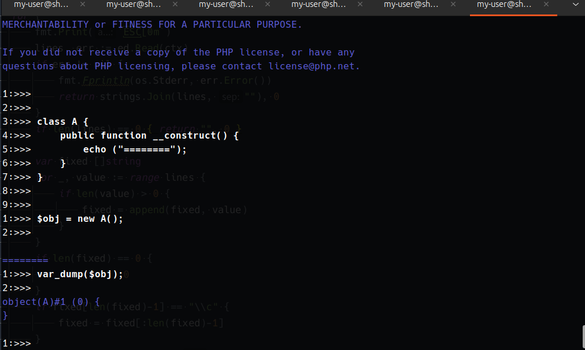

# モチベーション

**windows端末上で,かつreadlineなどが動作しない環境においてPHPの仮想REPLを使いたい**

## phpデフォルトのインタラクティブシェル
phpにもデフォルトで組み込まれているreadlineを使ったインタラクティブシェルがありますが,
こちらはあやまってctrl+(なにか)を押すと一発で終了してしまいますし,
warningやfatal error 何一つ装飾なしで出力されるので視認性が良くないと感じていました。

## PHP  interactive shell written in Golang
PHPのコードをターミナル上でちょこちょこっと実行したいとき,
なにか特定のインターフェースや抽象クラスを実装してテストしたいときなど
そんなときに複数行でクラス定義して実行できる・・そんなPHPシェルをGolangで書いています。
得に難しいことはやってなくて,技術的に注目を集めるものではありませんが,よければ使って下さい。

### 使い方
- 入力した内容を実行する
    - Enterキー次の行を入力する
    - ALTキー + Enterキー => コードの実行
        - ※Alt+Enterを押さない限りソースは実行されません

### php組み込みのinteractive shellとの違い

上記のように複数行に渡って変種が可能
カーソルキーで上下左右を編集して
Alt + Enterキー(ctrl + Enterキー on windows)で実行するまで
入力したコードは実行されません。

### Sample 01

### Sample 002

